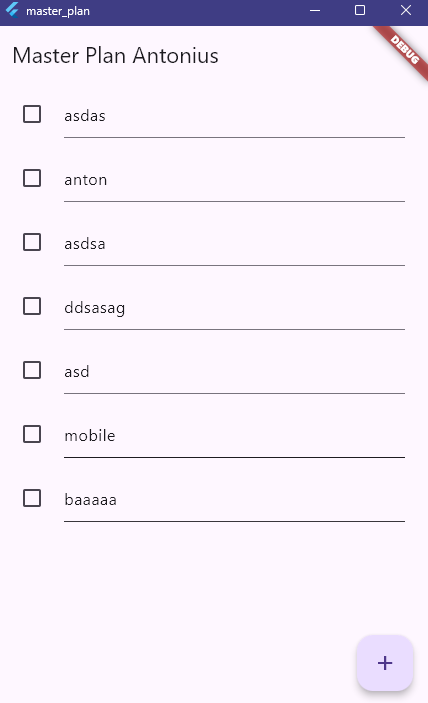
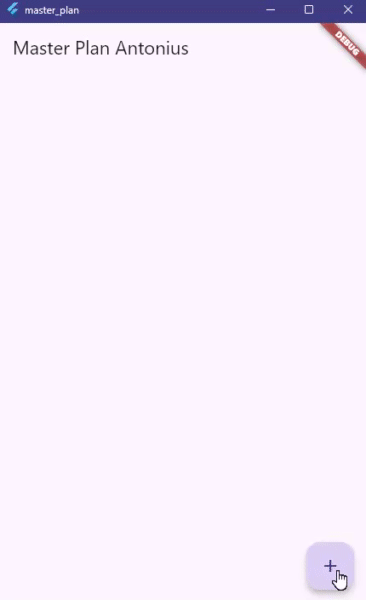
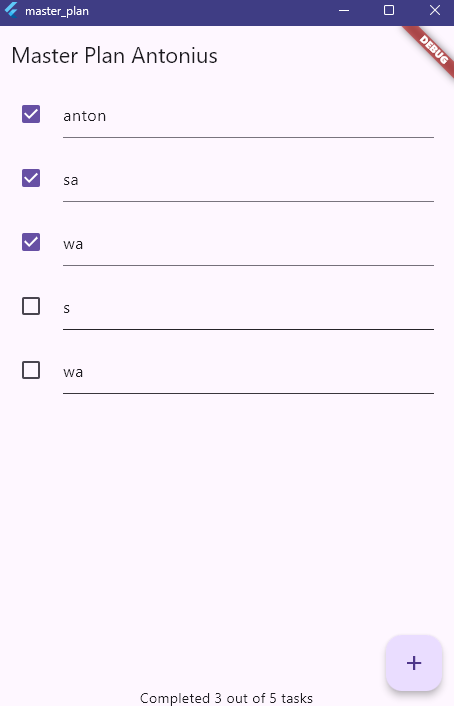
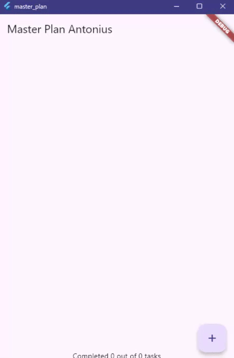
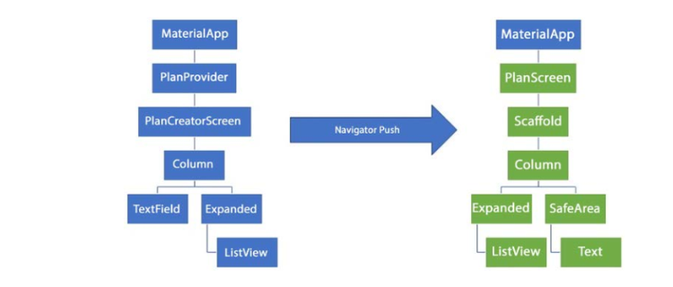
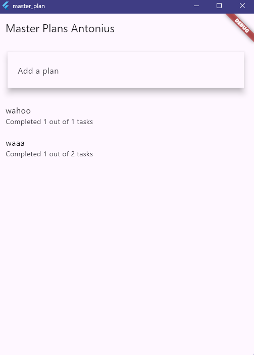
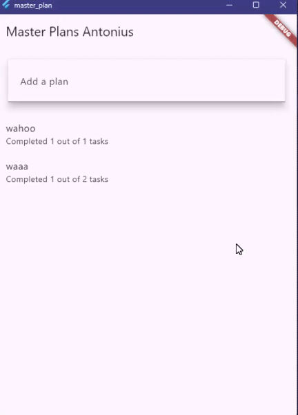
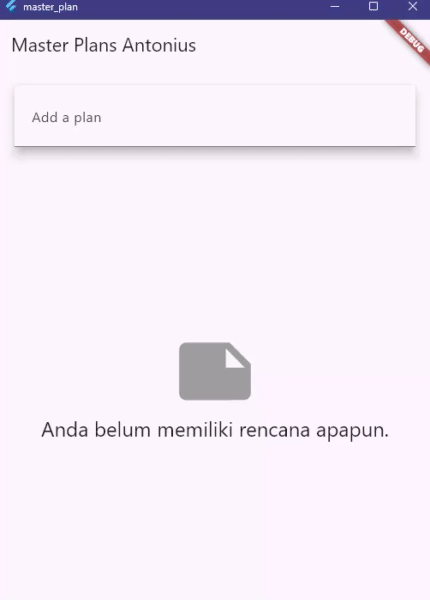

# Practicum 1 Task

1. Selesaikan langkah-langkah praktikum tersebut, lalu dokumentasikan berupa GIF hasil akhir praktikum beserta penjelasannya di file README.md! Jika Anda menemukan ada yang error atau tidak berjalan dengan baik, silakan diperbaiki.
2. Jelaskan maksud dari langkah 4 pada praktikum tersebut! Mengapa dilakukan demikian?
3. Mengapa perlu variabel plan di langkah 6 pada praktikum tersebut? Mengapa dibuat konstanta ?
4. Lakukan capture hasil dari Langkah 9 berupa GIF, kemudian jelaskan apa yang telah Anda buat!
5. Apa kegunaan method pada Langkah 11 dan 13 dalam lifecyle state ?
6. Kumpulkan laporan praktikum Anda berupa link commit atau repository GitHub ke dosen yang telah disepakati !

# Answer for Practicum 1 Task

1. End result of Practicum 1

2. For Step 4, add a data_layer.dart file, which exports plan.dart and task.dart model files. The reason is to make it easier to import in other parts of the application; for example, in plan_screen.dart, we wouldn't have to import each one individually, but instead we can just import data_layer.dart and get all the models within that layer.

3. The plan variable in Step 6 is necessary because it holds the state of the application, which is all the data for the to-do list, including the list of tasks. This is initially created as a constant via const Plan to provide a default, empty state that will be used when the PlanScreen widget is first built. This constant constructor provides an empty title and an empty list of tasks as the starting point before the user has added or modified any items.

4. 

Step 9 implements the _buildTaskTile method that is responsible for the look of each task in the list. It returns a ListTile that contains a Checkbox and a TextFormField. A tap on the Checkbox toggles the complete status of a task. The TextFormField lets a user type and edit the description of the task. Both widgets call setState in their onChange events to update the plan variable and rebuild the screen with updated data.

5. The methods in Step 11 and Step 13 are significant portions of the lifecycle of a StatefulWidget. The method initState in Step 11 serves only once when the State object is first created and inserted into the tree. It is used for one-time setup, such as initializing ScrollController and adding a listener to it. The dispose method in Step 13 is called when the State object is being permanently removed from the tree. Its job is to clean up resources and listeners to avoid memory leaks; hence, it is used for calling scrollController.dispose().

# Practicum 2 Task

1. Selesaikan langkah-langkah praktikum tersebut, lalu dokumentasikan berupa GIF hasil akhir praktikum beserta penjelasannya di file README.md! Jika Anda menemukan ada yang error atau tidak berjalan dengan baik, silakan diperbaiki sesuai dengan tujuan aplikasi tersebut dibuat.
2. Jelaskan mana yang dimaksud InheritedWidget pada langkah 1 tersebut! Mengapa yang digunakan InheritedNotifier?
3. Jelaskan maksud dari method di langkah 3 pada praktikum tersebut! Mengapa dilakukan demikian?
4. Lakukan capture hasil dari Langkah 9 berupa GIF, kemudian jelaskan apa yang telah Anda buat!
5. Kumpulkan laporan praktikum Anda berupa link commit atau repository GitHub ke dosen yang telah disepakati !

# Answer for Practicum 2

1. I have completed the practicum.

End result:

2. In Step 1 the PlanProvider class is the InheritedWidget. It works by extending InheritedNotifier, which is a special type of InheritedWidget designed to handle data that changes. InheritedNotifier is used specifically because it holds a ValueNotifier. This combination allows widgets down the tree to not only read the data but also to efficiently rebuild only when the ValueNotifier reports a change, which is more efficient than using a standard InheritedWidget for state that mutates.

3. The methods in Step 3 are getters added to the Plan model. The completedCount getter calculates the total number of tasks whose complete property is set to true. The completenessMessage getter uses that count to create a formatted string, such as "Completed 2 out of 5 tasks". This is so the business logic stays in the model layer and out of the view layer, cleaning up the code and putting the logic for counting tasks in one place.

4. 

Step 9 refactored the main lawet of the PlanScreen to use a ValueListenableBuilder that listens for changes on the PlanProvider to the Plan object. The lawet is composed of a Column that organizes its children vertically. An Expanded widget wraps the _buildList so that it takes up most of the screen, and a SafeArea at the bottom displays the plan.completenessMessage text above any system UI.

# Practicum 3 Task

1. Selesaikan langkah-langkah praktikum tersebut, lalu dokumentasikan berupa GIF hasil akhir praktikum beserta penjelasannya di file README.md! Jika Anda menemukan ada yang error atau tidak berjalan dengan baik, silakan diperbaiki sesuai dengan tujuan aplikasi tersebut dibuat.
2. Berdasarkan Praktikum 3 yang telah Anda lakukan, jelaskan maksud dari gambar diagram berikut ini!

3. Lakukan capture hasil dari Langkah 14 berupa GIF, kemudian jelaskan apa yang telah Anda buat!
4. Kumpulkan laporan praktikum Anda berupa link commit atau repository GitHub ke dosen yang telah disepakati !

# Answer

1. I have finished practicum 3

End result:

GIF:

2. This diagram shows the widget tree for the two screens in the application and how they share state. The PlanProvider is placed high in the tree, directly under the MaterialApp, allowing it to provide the central list of plans to all screens lower in the tree. The left tree represents the PlanCreatorScreen; its lawet is a Column with a TextField at the top to add new plans and an Expanded ListView below it displaying the list of all created plans. The Navigator Push arrow shows what happens when we tap on an item in that ListView: it will push the PlanScreen onto the stack, the one represented by the right-hand-side widget tree. Its lawet is also a Column; it contains an Expanded ListView to show the tasks for the tapped plan and a SafeArea at the bottom displaying the completenessMessage.

3. 

The code is for a two-screen application for managing multiple to-do lists. The main screen, PlanCreatorScreen, serves as the home screen. It displays at the top a TextField where we can type the name of a new "master plan". When we are done with typing this creates a new plan and adds it to a list displayed on the bottom half of the screen. If no plans have been created, this bottom section simply displays a message stating that we do not have any plans yet.

When we tap on one of the plans listed in this list, the application navigates us to the second screen, the PlanScreen, which is the original task list screen but now only shows the tasks of the particular plan we tapped. We can add tasks to this plan with the floating action button and edit or mark them complete as was performed in the prior practicum.